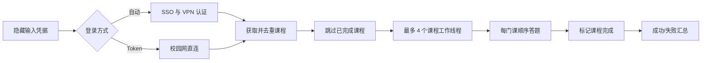

# LabPass (Fork)

> 本仓库是 [MapleSugarCake/LabLearningAutoPass](https://github.com/MapleSugarCake/LabLearningAutoPass) 的 fork，原作者：**MapleCake（NJUPT 2025届）**。

## 快速开始

直接去右边 **Releases** 页面下载 `labpass.exe`，双击运行即可，无需安装 Python 或任何依赖。

- **普通使用**：双击 `labpass.exe`，按提示输入学号密码
- **修正之前答错的题目**：在 exe 所在地址栏输入 `cmd` 回车，然后运行 `labpass.exe --redo`
- **校园网环境**：运行 `labpass.exe --login-mode token`，按提示粘贴 Token

> Windows SmartScreen 提示时选"更多信息" → "仍要运行"；杀毒软件误报请加白名单。

## 本 fork 的功能

在原版基础上新增 --redo 参数，用于**修正之前答错的题目**：

- **--redo**：重新处理所有课程（包括已完成的），用题目接口返回的正确答案重新提交，覆盖之前答错的记录
- **兼容 Python 3.9+**：原版要求 Python 3.13+，本 fork 降级兼容，Anaconda 等自带 Python 3.9 的环境也能直接跑
- 其余功能与原版完全一致：自动 SSO/VPN 登录、动态获取课程、最多 4 线程并发、GET 重试 POST 不重试、日志脱敏

### 使用方法

```powershell
# 正常跑（跳过已完成课程）
python main.py

# 重新刷已完成课程，修正错题
python main.py --redo

# 单线程 + 调试模式，第一次跑建议这样
python main.py --redo --workers 1 --debug
```

## 致谢

感谢原作者 [MapleCake](https://github.com/MapleSugarCake) 开发并开源了这个项目，自动登录、加密复刻、并发控制和错误处理都写得非常扎实。本 fork 仅做了一个小功能扩展，核心设计和代码均来自原作者。如果这个工具帮到了你，**请去原作者仓库点个 star 支持他**：

- 原项目：[MapleSugarCake/LabLearningAutoPass](https://github.com/MapleSugarCake/LabLearningAutoPass)
- 本 fork 仅作个人学习与错题修正使用，不用于任何商业用途

---


> 南京邮电大学实验室安全教育课程辅助脚本
>
> Version 1.0.1 · Python 3.13+

LabPass 可以自动登录实验室安全教育系统，动态发现当前账号的课程，完成课程题目并提交学习完成状态。脚本默认同时处理最多 4 门课程，并为普通用户提供清晰进度，为开发者提供脱敏调试输出。

> [!WARNING]
> 本项目仅用于处理本人账号下的课程学习与课程答题。考试仍需本人手动完成。请遵守学校规定，不要共享账号、密码或 Token，也不要出售本项目或将其用于未经授权的账号。

## 功能特性

- 自动完成 NJUPT 统一身份认证和 VPN 登录
- 动态获取账号课程，不维护易失效的硬编码课程 ID
- 自动跳过已完成课程，按课程 ID 去重
- 课程级 1–4 线程并发，默认使用 4 个线程；课程读取可并行，状态变更 POST 串行
- 单门课程内严格按题目顺序提交，全部成功后才标记课程完成
- GET 请求超时重试，POST 请求不盲目重试
- 课程失败后继续处理其他课程，并在结尾统一汇总
- 默认输出简洁进度，`--debug` 提供脱敏诊断信息
- 支持 Python 源码与 Windows 控制台 EXE

## 使用前准备

源码运行需要：

- Windows 10/11
- Python 3.13 或更高版本
- [uv](https://docs.astral.sh/uv/)
- 可访问南京邮电大学统一认证与 VPN 服务的网络

项目不会保存账号、密码、Token、Cookie 或运行日志。密码和 Token 均使用隐藏输入。

## 快速开始

### 源码运行

`````powershell
git clone https://github.com/MapleSugarCake/LabLearningAutoPass.git
cd LabLearningAutoPass
uv sync
uv run labpass
```

也可以继续使用兼容入口：

`````powershell
uv run python main.py
```

程序会依次提示输入学号和密码。自动登录失败时，可选择切换到手动 Token 模式。

### Windows EXE

直接运行 `labpass.exe`，按照控制台提示操作即可。冻结版默认在结束时等待回车，以便查看结果；从已有终端启动时可使用：

`````powershell
labpass.exe --no-pause
```

## 登录方式

| 模式 | 命令 | 适用场景 |
| --- | --- | --- |
| 自动登录 | `uv run labpass` | 默认方式，通过统一认证和学校 VPN 获取业务 Token |
| 手动 Token | `uv run labpass --login-mode token` | 自动登录流程临时失效时使用；必须连接校园网 |

手动 Token 获取步骤：

1. 连接校园网并访问 `http://10.22.192.38:9092/`，登录自己的账号。
2. 打开任意课程，然后打开 Chrome/Edge 开发者工具的“网络”面板。
3. 使用 `updatevisits` 过滤请求并刷新页面。
4. 在 XHR 请求标头中复制 `x-access-token`。
5. 启动手动模式，并在隐藏输入提示中粘贴 Token。

Token 等同于临时登录凭据，请勿截图、上传或发送给他人。

## 命令行参数

```text
usage: labpass [-h] [--workers 1-4] [--debug]
               [--login-mode {auto,token}] [--no-pause] [--version]
```

| 参数 | 默认值 | 说明 |
| --- | --- | --- |
| `--workers 1-4` | `4` | 同时调度的课程数；题目读取可并行，答题和完成 POST 会自动串行 |
| `--debug` | 关闭 | 显示请求阶段、端点、耗时和异常堆栈；敏感信息仍会脱敏 |
| `--login-mode auto\|token` | `auto` | 选择自动登录或校园网手动 Token 登录 |
| `--no-pause` | 关闭 | EXE 运行结束后不等待回车 |
| `--version` | — | 显示当前版本 |

示例：使用两个课程线程并开启调试输出。

`````powershell
uv run labpass --workers 2 --debug
```

## 运行输出

默认输出只展示用户需要关注的信息：

```text
15:30:01 | INFO    | MainThread | LabPass 1.0.0
15:30:02 | INFO    | MainThread | 自动登录成功
15:30:03 | INFO    | MainThread | 发现 12 门课程：4 门已完成，8 门待处理
15:30:03 | INFO    | course_0  | 开始处理：消防安全（181...）
15:30:05 | INFO    | MainThread | [1/8] 完成：消防安全（181...），已提交 2 道题
15:30:12 | INFO    | MainThread | 执行汇总：发现 12，跳过 4，成功 8，失败 0，总耗时 11.2 秒
```

若某门课程失败，脚本会继续处理其他课程，并在最后列出课程和原因。POST 超时会标记为“提交结果不确定”，此时请先到网页核对，不要立即重复运行。

## 项目架构

```text
LabLearningAutoPass/
├── main.py                  # 源码与 PyInstaller 兼容入口
├── labpass/
│   ├── auth.py              # SSO/VPN 自动认证与 Token 回退
│   ├── client.py            # API 请求、响应校验与独立工作 Session
│   ├── runner.py            # 最多 4 线程的课程调度和结果聚合
│   ├── cli.py               # 参数、交互、退出码和最终汇总
│   ├── models.py            # Course、Question、CourseResult 等模型
│   ├── config.py            # URL、超时、请求头和并发默认值
│   ├── http.py              # GET-only 重试策略
│   ├── crypto.py            # 与学校前端兼容的 AES-CBC 加密
│   └── logging_utils.py     # 控制台日志与敏感信息脱敏
├── tests/                   # 不访问真实学校接口的模拟测试
├── main.spec                # Windows 控制台 EXE 构建配置
├── favicon.ico              # EXE 图标
├── pyproject.toml           # 项目元数据、依赖和工具配置
└── uv.lock                  # 可复现依赖锁文件
```

执行流程：



`requests.Session` 不在线程间共享。登录会话只负责获取课程列表，每门并发课程都会复制认证快照并创建独立 Session，任务结束后立即关闭。不同课程可以并行读取题目，但所有答题和课程完成 POST 通过同一个写入协调器串行发送，避免争抢学校服务器的业务锁。

题目接口中的三个 ID 含义不同：题目关系记录的 `id` 用作提交请求的 `questionId`，关系记录的 `courseId` 用作提交请求的 `id`；题库自身的 `questionId` 不参与答题提交。该映射以网页端实际成功请求为兼容基线。

## 错误处理与退出码

| 退出码 | 含义 |
| --- | --- |
| `0` | 所有待处理课程成功，或没有待处理课程 |
| `1` | 至少一门课程失败；其他课程已继续处理 |
| `2` | 配置、登录、课程列表或全局认证状态失败 |
| `130` | 用户通过 `Ctrl+C` 中断 |

常见问题：

| 现象 | 建议 |
| --- | --- |
| 自动登录失败 | 检查账号密码、统一认证是否新增验证码；按提示尝试校园网 Token 模式 |
| 请求超时或服务器 5xx | 稍后重试，或使用 `--workers 1` 降低并发 |
| HTTP 401/403 | 登录状态已失效，重新启动脚本登录 |
| `acquire lock fail` / `aquire lock fail` | 脚本不会自动重试该 POST；先确认使用最新版本，稍后重试并在网页核对状态 |
| POST 结果不确定 | 先在网页检查课程/题目状态，避免重复提交 |
| 需要报告问题 | 使用 `--debug` 重现，并只提供已脱敏的控制台输出 |

调试模式不会主动输出请求体、密码、Token、Cookie 或 CAS ticket；响应异常时最多显示截断并脱敏的摘要。提交问题前仍请人工检查输出中是否包含个人信息。

## 开发与测试

安装开发和构建依赖：

`````powershell
uv sync --group dev --group build
```

运行质量检查：

`````powershell
uv run python -m compileall -q main.py labpass tests
uv run pytest
uv run ruff check .
uv run ruff format --check .
```

测试使用模拟 HTTP Session，不会登录真实账号，也不会向学校接口提交数据。

## 构建 Windows EXE

`````powershell
uv run --group build pyinstaller --clean main.spec
```

构建产物位于 `dist/labpass.exe`。`main.spec` 使用控制台模式，以保证交互输入和运行进度可见。

## 已知限制

- 学校统一认证、VPN 路径或业务响应字段变化后，自动登录可能需要同步更新。
- 手动 Token 模式使用校内直连地址，校外网络不可用。
- 为避免重复写入，POST 请求不会自动重试；超时后需人工核对结果。
- 多课程模式会并行获取题目，但答题与完成请求会串行发送，因此线程数主要改善读取和等待阶段的效率。
- 本项目不会自动完成考试，也无法替代用户对最终网页状态的确认。

## 作者与反馈

- Author: MapleCake（NJUPT 2025届）
- GitHub: [MapleSugarCake/LabLearningAutoPass](https://github.com/MapleSugarCake/LabLearningAutoPass)
- QQ: 292441165

本项目坚持免费。如发现倒买倒卖，请勿购买。
